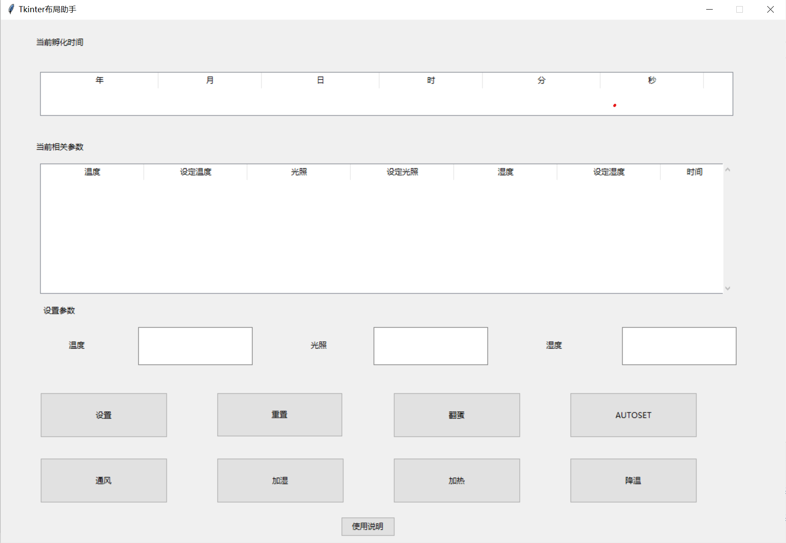

# 智能孵蛋管理系统

[TOC]

## 1.前置部分
### 1.1 封面：
**实验名称：** 智能孵化管理系统的设计与开发

**姓名：** 车扬帆

**班级：** 计科2101

**学号：** 202104060709

**指导老师：** 刘三一

**设计时间：** 2023.8.28-2023.9.4

---

### 1.2 摘要：

本次实验旨在通过设计和开发智能孵化管理系统，探究电子产品设计与开发、系统设计与集成、数据处理与算法应用等方面的基本知识和技能，并且提升参与者的团队协作和解决问题的能力。该系统可以实现对孵化环境的智能调节和控制，包括温度、湿度、光照等参数的监测和调节，为鸟类、爬行动物等动物的孵化提供良好的生长环境。本实验将采用硬件设计、传感器应用、电路设计、单片机编程等多种技术手段.

---
### 1.3 关键词：
传感器应用；单片机编程；数据处理；系统设计与集成；监测与调节

---
### 1.4 绪论:
智能孵化管理系统是一种应用于动物孵化过程的智能化技术，通过集成多种传感器和控制器，实现对孵化环境的精确监测和智能调节。随着科技的发展和人们对动物生态保护的关注不断增加，智能孵化管理系统在饲养业、研究机构以及野生动物保护中具有重要意义。

传统的孵化环境调节主要依靠人工操作，存在监测不准确、调节不精细等问题。而智能孵化管理系统通过引入先进的电子产品设计与开发技术，可以有效地解决这些问题。该系统结合了硬件设计、传感器应用、电路设计以及单片机编程等多个领域的知识和技术，能够实时监测孵化环境中的温度、湿度和光照等关键参数，并根据设定的标准自动调节。

在本次实验中，我将以智能孵化管理系统的设计与开发为目标，学习和应用相关的电子产品设计与开发技术。首先，我将对孵化环境的需求进行分析和需求规划，确定系统的功能和性能指标。然后，我将进行电路设计和传感器选择，并完成硬件的制作和调试工作。接下来，我将学习和应用单片机编程，实现数据采集、处理和控制算法的设计。最后，我将对整个系统进行集成测试，并进行性能评估和优化。

通过参与本次实验，我将不仅掌握智能孵化管理系统设计与开发的基本原理和方法，还能提升我的团队协作和解决问题的能力。同时，我也能够理解和应用实验方法和流程，为我今后的学习和研究打下坚实的基础。通过这个项目，我将迈向更高的科学和技术的领域，为动物生态保护和养殖业的发展做出贡献。

---
## 2.主体部分

### 2.1 项目介绍
监控光照温度湿度以及孵化周期,在未与串口进行通信的模式下通过内置的参数区间以及算法将孵化时期对应的温度湿度进行调节，以及在进行串口通信的时可通过我自己编写的图形界面与学习板进行交互，从而实现对板子的各项参数的控制，除此之外，该系统还配备了翻蛋，通风，加湿，降温，加热五大额外功能，实现更好的智能孵化管理

### 2.2 全局状态设计
**如下为全局状态设计，将在实现功能时始终发挥作用**
>  1.flag_auto_set=0 ==>初始状态
>  重置后或者是开机后的初始状态，等待操作的加载

>  2.flag_auto_set=1 ==> 自动模式
> 将按照内置的相关参数范围进行温湿度调节，并且将温湿度数据进行记录，当达到设定值时，将进行翻蛋，通风，加湿，降温，加热

>  3.flag_auto_set=2 ==> 手动
> 按照设定的相关参数进行调节，当达到设定值时，将进行翻蛋，通风，加湿，降温，加热，并且不会进入别的状态，直至下次进入自动模式，在此模式中单独进行翻蛋，通风，加湿，降温，加热操作将不会影响其余一组的参数调节。
> 例如当进行加湿操作时，不会影响到翻蛋，降温，加热操作

>  4.flag_auto_set=3/4/5/6 ==> 半手动半自动模式
>  在半手动半自动模式下 ，将对应不同状态下的额外操作进行记录，并在手动模式下进行调用,并且此前是否设置参数将不会影响正常结果,具体对应结果在main.c中有体现

> 5.额外操作设计
> 将操作分为3组
> 1.    温度控制：降温<->加热
> 2.    湿度控制：加湿<->通风
> 3.    翻蛋控制：翻蛋
> 
> 并且进行一组额外操作时，将不影响另一组的操作

### 2.3 功能设计以及相关实现

### 2.3.0 串口设计：
串口默认连接为com3,当然也可以在串口界面进行选择，并且串口通信时，将实时将板子采集到的温湿度数据发送至电脑，并且将电脑发送过来的数据进行记录，当数据达到一定量时，将进行数据处理，并且将处理后的数据进行发送，具体实现如下：
```py
    def select_com(self,evt):
        selected_port = self.tk_select_box_select_com_face.get()  # 获取选择的串口
        if not selected_port:  # 如果没有选择串口，默认选择com3
            selected_port = 'com3'
        self.com.port = selected_port  # 将选择的串口赋值给self.com的port属性
        try:
            if self.com.is_open:  # 如果串口已经打开，则先关闭它
                self.com.close()
            self.com.open()  # 打开新的串口
            print(f"成功打开串口{selected_port}")
            messagebox.showinfo("串口打开成功", f"成功打开串口{selected_port}")
            # 重新启动更新数据的定时器
            self.after(1000, self.update_tables)
        except serial.SerialException as e:
            messagebox.showerror("串口错误", str(e))
```

#### 2.3.1 时间显示：
时间显示分为了年月日时分秒，按下k1可进行两者的切换
因为多种原因，我选择的是自己设计一个时间自增函数，通过1s的系统事件将时间实现自增,并且实现了串口通信，将实时板子记录的时间发送至电脑
具体函数表现如下：
```c
void time_add(){
    ...
    t.second++;
    if (t.second == 60) {
        t.second = 0;
        t.minute++;
        if (t.minute == 60) {
            t.minute = 0;
            t.hour++;
            if (t.hour == 24) {
                t.hour = 0;
                t.day++;
                if (t.day == 32) {
                    t.day = 1;
                    t.month++;
                    if (t.month == 13) {
                        t.month = 1;
                        t.year++;
                    }
                }
            }
        }
    }
    ...
}
...
SetEventCallBack(enumEventSys1S, time_add);

```

#### 2.3.2 温度：
使用EXT.h中的相关函数进行收集并且转化为正确的温度读数
设定显示在时分秒之后再次按下k1可显示温度，用小写t代表，右侧数码管设定温度s用5代替显示
内置的温度范围（仅供参考）：
>   孵化期为21天。
    1～6天为38.5℃；7～14天为38℃；15天为37.9℃；16～21天为37.3～37.5℃。
调用bsp库 从温度传感器中获取温度 并且按照设定显示即可,加上了串口通信，将温度数据发送到电脑上
具体实现如下：(仅显示temp_show()函数)
```c
void temp_show()
{
    AdcInit(ADCexpEXT);
    DisplayerInit();
    Key_Init();
    SetEventCallBack(enumEventSys100mS, get_adc);
}
```

#### 2.3.3 光照：
使用EXT.h中的相关函数进行收集并且转化为正确的光照读数
具体使用光照进行温度控制 温度高调小 温度低调大（此处添加了加热和降温功能，但是因为缺少外接模块，所以此处的光照仅供显示参数作用，若具有相关外界模块，可以通过调节亮度实现温度控制）
使用 k1 键进行切换，设定在温度后再次按下k1即可
0位显示L（大写），右侧数码管设定光照s用5代替显示
调用bsp库 从光敏传感器中获取光照强度 并且按照设定显示,加上串口通信，将光照强度数据发送到电脑上
具体实现如下：(此处仅显示light_show()函数)
```c
void light_show()
{
    AdcInit(ADCexpEXT);
    DisplayerInit();
    Key_Init();
}
```
**注：因为adc相关函数采集一次数据便可获得，因此在light_show()中没有显示adc相关函数，在表示中显示即可**
#### 2.3.4 湿度
使用外界模块进行收集（DTH11）
使用 k1 键进行切换，设定在光照后再次按下k1即可

调用自己采购的湿度模块DTH11，进行湿度采集，并且按照设定的格式进行显示，在串口通信的基础上将湿度数据实时反馈即可
具体实现如下：
```c
unsigned char COM(void) {
    unsigned char i,dat=0;

  for(i = 0; i < 8; i++) {
    while(P1_0)
      ;
    while(!P1_0)
      ;
    Delay_10us();
    Delay_10us();
    Delay_10us();
    Delay_10us();
    Delay_10us();
    dat <<= 1;
    if(P1_0) {
      dat |= 1;  // 0
    };
  }  // rof
  return dat;
}

void RH(void) {
  // 主机拉低18ms
  P1_0 = 0;
  Delay10ms();
  Delay10ms();
  P1_0 = 1;
  // 总线由上拉电阻拉高 主机延时20us
  Delay_10us();//延时函数
  Delay_10us();
  Delay_10us();
  // 主机设为输入 判断从机响应信号
  // P1_0 = 1;
  // 判断从机是否有低电平响应信号 如不响应则跳出，响应则向下运行
  if(!P1_0)  // T !
  {
    while(!P1_0)
      ;
    Delay_10us();
    Delay_10us();
    Delay_10us();
    Delay_10us();
    Delay_10us();
    U8RH_data_H=COM();
  }
}

```

内置湿度区间(仅供参考)
>孵化初期要求相对湿度保持在60％～70％；中后期要求相对湿度保持在50％～55％；出壳期要求相对湿度保持在65％～70％

#### 2.3.5 翻蛋
>背景：鸡蛋在孵化过程中，还需要定时翻蛋 8-12次一天
设定在开启机器的时间将会进行一次翻蛋，并且每8小时进行一次翻蛋，但是重置机器并不会进行翻蛋
表现形式：（操控步进电机1）显示led闪烁即可 ==>SetStepMotor(enumStepMotor1, 2, 20);

#### 2.3.6 通风
作用：通过通风来控制相关湿度
表现形式：操控步进电机2 ==>SetStepMotor(enumStepMotor2, 5, 100);

#### 2.3.7 加湿
作用：通过加湿来控制相关湿度
表现形式：操控步进电机2 ==>SetStepMotor(enumStepMotor2, 5, -100);

#### 2.3.8 加热
作用：通过加热来控制相关温度
表现形式：操控步进电机3 ==>SetStepMotor(enumStepMotor3, 5, -100);

#### 2.3.9 降温
作用：通过降温来控制相关温度
表现形式：操控步进电机3 ==>SetStepMotor(enumStepMotor3, 5, 100);

#### 2.3.10 autoset
作用：进入离线模式，将按照内置参数进行检测，自主实施相关操作，以达到将相关参数调整至内置的参数范围内
**注意：**
1. 此处需要进行串口通信，将相关数据发送到电脑上，便于调试
2. 此处如果人为主动进行额外操作将进入第三种状态 设置flag_auto_set=3/4/5/6

#### 2.3.11 重置(reset)
将所有内容进行重置，包括时间，设定温度等等，并且在前端实时显示进行更新

#### 2.3.12 设置(set)
将设定的参数传入板子，并且自动根据设定的参数自主进行相关操作，以达到设定参数临近区间内，未填写的参数默认为0
设定：按下set键之后将自动进入手动状态，直至下次按下autoset键。

#### 2.3.13 使用说明
点击获得详细内容以及教程讲解


### 2.4 UI设计


### 2.5 仪器设备
1.  stc-b学习板
2.  DTH11温湿度模块

### 2.6 学习板搭配界面使用方法
1.  首先打开前端界面的文件
2.  连接湿度模块，将板载文件下载至stc-b学习板
3.  在前端界面进行操作即可
**注：**
    1.  打开py文件之后板子将处于初始状态，即flag_auto_set=0  
    2.  相关的autoset和设置操作将在用户点击之后进行
    3.  如果用户手动进行相关额外操作，将进入第三种状态 设置flag_auto_set=3/4/5/6
    4.  在相关参数那一栏只有当参数发生变化时才会记录下来，并且将变化的时间也相对记录
    5.  **温度范围  上下2**
        **湿度范围  上下5**
    

机器孵化出雏期温度可降低 0.5℃。孵化的相对湿度宜控制在 40～70% 范围内，以 53～60% 为宜，出雏期以 65～70% 为宜。


### 2.7 数据处理以数据发送
#### 2.7.1 接收数据
设定get_buffer[8] 用来接收数据
相关参数为：温度 光照 湿度 是否翻蛋 是否通风 是否加湿 是否加热 是否降温
每次接受到串口发来的信号时，调用deal_info函数进行处理，实现前端对板子的控制
**deal_info函数**
```c
void deal_info()
{
    int flag_person_set = whether_set();
    int whether_set_pars;

    flag_reset = 0;
    // unsigned char get_buffer[8]温度 光照 湿度 是否翻蛋 是否通风 是否加湿 是否加热 是否降温
    set_temp      = get_buffer[0];
    set_light     = get_buffer[1];
    set_wet       = get_buffer[2];
    flag_move_egg = get_buffer[3];
    flag_get_wind = get_buffer[4];
    flag_get_wet  = get_buffer[5];
    flag_get_hot  = get_buffer[6];
    flag_get_cold = get_buffer[7];
    if (flag_get_wind == 2 && flag_move_egg == 2 && flag_get_hot == 2 && flag_get_wet == 2 && flag_get_cold == 2) {
        t.year     = 0;
        t.month    = 0;
        t.day      = 0;
        t.hour     = 0;
        t.minute   = 0;
        t.second   = 0;
        flag_reset = 1;
    }

    flag_auto_set = 0;
    if (flag_move_egg == 3) {
        EmStop(enumStepMotor2);
        EmStop(enumStepMotor3);
        flag_auto_set = 1; // 进入auto状态
        return;
    }
    whether_set_pars = whether_set_paraments(); //==>重置之后为2

    // 8个参数中有不为零的参数
    if (whether_set_pars == 1) {
        EmStop(enumStepMotor2);
        EmStop(enumStepMotor3);
        flag_auto_set = 2;
    }

    // 重置之后进入初始状态
    if (flag_reset == 1) {
        // move_egg();
        EmStop(enumStepMotor1);
        EmStop(enumStepMotor2);
        EmStop(enumStepMotor3);
        flag_auto_set = 0;
    }

    if (flag_move_egg == 1) {
        if (whether_set_pars == 2) {
            move_egg();
        } else {
            move_egg();
            flag_auto_set = 2;
        }
    }

    if (flag_get_wind == 1) {
        if (whether_set_pars == 2) {
            get_more_wind();
        } else {
            get_more_wind();
            EmStop(enumStepMotor2);
            flag_auto_set = 3;
            // return;
        }
    }
    if (flag_get_wet == 1) {
        if (whether_set_pars == 2) {
            get_more_wet();
        } else {
            get_more_wet();
            EmStop(enumStepMotor2);
            flag_auto_set = 4;
            // return;
        }
    }
    if (flag_get_hot == 1) {
        if (whether_set_pars == 2) {
            get_more_hot();
        } else {
            get_more_hot();
            EmStop(enumStepMotor3);
            flag_auto_set = 5;
            // return;
        }
    }
    if (flag_get_cold == 1) {
        if (whether_set_pars == 2) {
            get_more_cold();
        } else {
            get_more_cold();
            EmStop(enumStepMotor3);
            flag_auto_set = 6;
            // return;
        }
    }
}
```
相关步骤的说明以及上下关系在此文档均有说明

#### 2.7.2 数据发送
设定buffer[12] 用来发送数据
相关参数为：年 月 日 时 分 秒 温度 光照 湿度 设定温度 设定光照 设定湿度
使用send_info函数进行发送数据，并且与1s的系统事件相互绑定，设定波特率为9600
**send_info函数**
```c
void send_info()
{
    // 发送
    char res;
    set_buffer();
    Uart1Init(9600);
    res = Uart1Print(buffer, 12);
}
```

并且将buffer[]中的数据每秒进行更新即可
**set_buffer函数**
```c
void set_buffer()
{
    // unsigned char buffer[12];     // 年 月 日 时 分 秒 温度 光照 湿度 设定温度 设定光照 设定湿度
    buffer[0]  = t.hour;
    buffer[1]  = t.month;
    buffer[2]  = t.day;
    buffer[3]  = t.hour;
    buffer[4]  = t.minute;
    buffer[5]  = t.second;
    buffer[6]  = arrThermLUT[adc.Rt >> 2];
    buffer[7]  = adc.Rop;
    buffer[8]  = U8RH_data_H;
    buffer[9]  = set_temp;
    buffer[10] = set_light;
    buffer[11] = set_wet;
}
```


## 3.收获与不足
### 3.1 收获
1. **电子产品设计与开发能力提升**：通过完成该项目，您将有机会学习和应用电子产品设计与开发的基本知识和技能，包括硬件设计、传感器应用、电路设计、单片机编程等方面。

2. **系统设计与集成能力提升**：该项目涉及到多个功能模块的设计与集成，例如温度控制、湿度控制、光照检测等。在实验过程中，您需要将这些不同的功能模块进行合理的组织和集成，从而实现整个智能孵化管理系统。

3. **数据处理与算法应用能力提升**：该项目需要对温度、湿度、光照等数据进行采集和处理，并且根据设定的参数进行相应的调节操作。在实验过程中，您将学习和应用数据处理和算法技术，以实现对孵化环境的智能控制。

4. **团队协作与解决问题的能力提升**：在实验中，您可能需要与团队成员合作，共同完成任务。您将学习如何与他人合作、沟通和解决问题，这将有助于提升您的团队协作能力和解决问题的能力。

5. **实验方法与流程的掌握**：通过进行实验，您将学习到科学实验的基本方法和流程，包括实验设计、数据采集、结果分析等方面。这将对您今后进行其他实验和科研工作有所帮助。

### 3.2 不足
1.  还没与云端建立联系将数据传入至网上，实现真正的物联网
2.  相关参数数据获取模块的灵敏度不是很高，可以在提升
3.  可以添加更多功能以及更换性能更好的单片机


## 4. 拓展知识（孵蛋相关）
>   https://zhuanlan.zhihu.com/p/114975190
