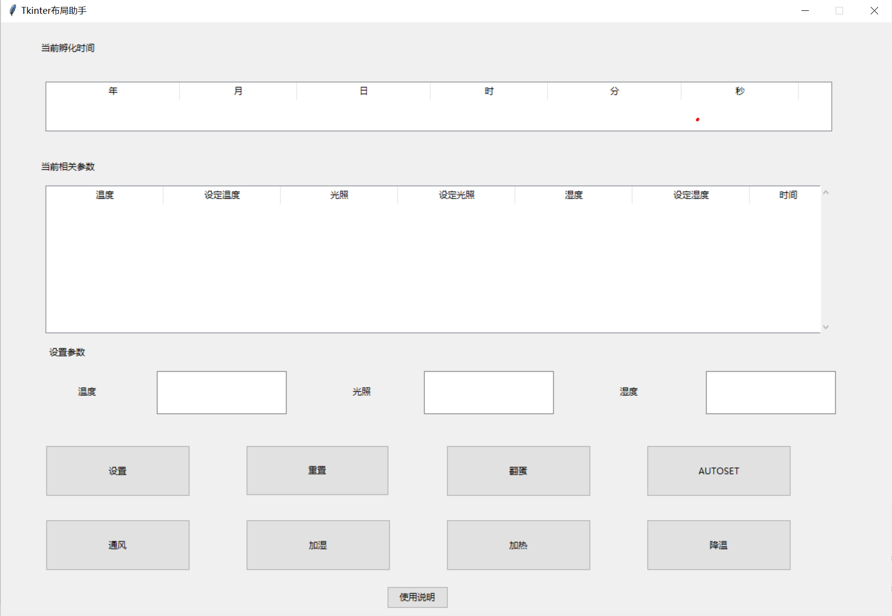

# 智能孵蛋机
## 项目介绍
监控光照温度湿度以及孵化周期,在未与串口进行通信的模式下通过内置的参数区间以及算法将孵化时期对应的温度湿度进行调节，以及在进行串口通信的时可通过我自己编写的图形界面与学习板进行交互，从而实现对板子的各项参数的控制，除此之外，该系统还配备了翻蛋，通风，加湿，降温，加热五大额外功能，实现更好的智能孵化管理

## UI设计

## 功能设计
### 1.时间显示：
时间显示分为了年月日时分秒，按下k1可进行两者的切换
### 2.温度：
使用EXT.h中的相关函数进行收集并且转化为正确的温度读数
设定显示在时分秒之后再次按下k1可显示温度，用小写t代表，右侧数码管设定温度s用5代替显示
内置的温度范围（仅供参考）：
>   孵化期为21天。
    1～6天为38.5℃；7～14天为38℃；15天为37.9℃；16～21天为37.3～37.5℃。

### 3.光照：
使用EXT.h中的相关函数进行收集并且转化为正确的光照读数
具体使用光照进行温度控制 温度高调小 温度低调大（此处添加了加热和降温功能，但是因为缺少外接模块，所以此处的光照仅供显示参数作用，若具有相关外界模块，可以通过调节亮度实现温度控制）
使用 k1 键进行切换，设定在温度后再次按下k1即可
0位显示L（大写），右侧数码管设定光照s用5代替显示

### 3.湿度
使用外界模块进行收集（DTH11）
使用 k1 键进行切换，设定在光照后再次按下k1即可
内置湿度区间(仅供参考)
>孵化初期要求相对湿度保持在60％～70％；中后期要求相对湿度保持在50％～55％；出壳期要求相对湿度保持在65％～70％

### 4.翻蛋
>背景：鸡蛋在孵化过程中，还需要定时翻蛋 8-12次一天

表现形式：（操控步进电机1）显示led闪烁即可 ==>SetStepMotor(enumStepMotor1, 2, 20);

### 5.通风
作用：通过通风来控制相关湿度
表现形式：操控步进电机2 ==>SetStepMotor(enumStepMotor2, 5, 100);

### 6.加湿
作用：通过加湿来控制相关湿度
表现形式：操控步进电机2 ==>SetStepMotor(enumStepMotor2, 5, -100);

### 7.加热
作用：通过加热来控制相关温度
表现形式：操控步进电机3 ==>SetStepMotor(enumStepMotor3, 5, -100);

### 8.降温
作用：通过降温来控制相关温度
表现形式：操控步进电机3 ==>SetStepMotor(enumStepMotor3, 5, 100);

### 9.autoset
作用：进入离线模式，将按照内置参数进行检测，自主实施相关操作，以达到将相关参数调整至内置的参数范围内

### 10.重置(reset)
将所有内容进行重置，包括时间，设定温度等等

### 11.设置(set)
将设定的参数传入板子，并且自动根据设定的参数自主进行相关操作，以达到设定参数临近区间内

### 12.使用说明
点击获得详细内容以及教程讲解

## 功能实现
## 1.温度666
调用bsp库 从温度传感器中获取温度 并且按照设定显示即可
（可加上串口通信，将温度数据发送到电脑上）

此处因为测试是无法达到孵化时所需要的温度的 但是蜂鸣器过于吵闹 所以换做led闪烁（代做）==>**也可以使用别的信息代替光照加热** 
假设使用串口通信将信息传至电脑上就不需要用led

## 2.光照
调用bsp库 从光敏传感器中获取光照强度 并且按照设定显示即可
（可加上串口通信，将光照强度数据发送到电脑上）

## 3.震动
通过震动传感器 获取震动强度 当震动超过阈值一段时间 则小鸡孵化 报警或者将信息发送到电脑

## 4.时钟 使用相关模块获取我从初始设定的时钟信息
将时钟信息带入算法 算出最适合的温湿度光照强度

# 具体文件
1. 时钟(年月日 时分秒) k3切换
2. 温度
3. 光照
4. 湿度
5. 通风
6. 操控步进电机（翻蛋）--->使用led模拟不仅电机的翻蛋操作
7. 补充：以上都可以进行通信 和电脑建立联系 还可以写出前端界面 方便进行温度湿度控制以及翻蛋操作

## 拓展知识
>   https://zhuanlan.zhihu.com/p/114975190

机器孵化出雏期温度可降低 0.5℃。孵化的相对湿度宜控制在 40～70% 范围内，以 53～60% 为宜，出雏期以 65～70% 为宜。

# 通信
## 1.方式 
串口通信 uart1
发送的数据 温度 光照 湿度 孵化时间 
信号字节数 ； 年月日 时分秒 
             温度 光照 湿度
            6+3=9
            湿度暂时不考虑 8
实现发数据 

需要实现的功能 板子接受数据 并且改变相应值 

进程：
1. 给温度光照加一个当前温度 一个设定温度 =>seg7print(**已实现**)
2. 板子接收数据并且根据数据进行更改数据(**已实现**)
3. 使用py将板子的数据进行接收！！！！！！！(**已完成**)
4. 解决serial不能使用的问题(**已完成**)
5. 写出前端界面 qt?? 或者是 别的前端语言 但是首先得解决的是使用py接收并且发送数据(**已完成**)
6. 将数据通过电脑发送给板子()(**已完成**)
7. 将执行的操作分为几类
    >   1. 设置各种基础信息（实际上是各种信息单独设置的函数集合）
        2. 将板子进行重置
        3. 设置各类信息的单独设置==>
    注：将发送的信息默认设置为0 如果设置了 则将对应位改变即可

8. 另外在main.c中deal_info中可以添加包头进行信号的分类
9. 对界面进行设计(**已完成**)
10. reset无法重置时间(SUCCESS)

当前进程：
1. 将数据正确显示(success)
2. 重置具有时间延迟(待定)
3. 没有把当前的设定温度传给电脑
4. 无法set设定温度(SUCCCESS)
5. 加装湿度模块
6. 将deal_info模块进行重写 不需要设定时间 并且加上湿度设定(success)
7. 加一个通风功能 使用步进电机控制
8. 将湿度定位小写e写入now_seg_show中
9. set_info中temp前得多一个零(SUCCESS)
10. **设定通风和加湿使用步进电机 不同方向 前四个  加光照 后四个 同翻蛋相反 **记得判断led是否被占用**=>可以使用seg表示 或者使用某一个led亮即可**==>可以使用led的组合eg0x101
11. 设定多两个按键 通风 加湿 (SUCCESS)
12. 板子发送的信息多4个

后续功能：
1. 可以将自己写的时间模块换成他给的时间模块
2. 实现在将一段时间的数据写入储存模块 实现断电时的数据存储 
3.  七八两个功能在实现串口的通信之后再去考虑 属于锦上填花的功能 

ps：温度需要加装模块 实际温度和设定温度（set->s）(**已完成**)

1. 湿度信息发到电脑上 设定信息发到电脑上(SUCCESS)
2. 板子接数据 电脑发数据 
   注：重置时间为4个待选参数均为2
3. seg+步进电机 一个时间只能执行一个
4. 换一个地方接湿度传感器 可能是adc初始化问题

加湿 通风 ==>motor2
加热 降温 ==>motor3
翻蛋==>motor1
数值变大就是-步数   向右
设定一个exter_func==>集中判断是否进行操作(待定)

板子发送12 板子接收8

增加一个降温

写自动控制函数 根据时间来确定温度 湿度 等参数 根据这个参数进行判断
注意autoset函数 如果进入autoset 设置一个全局变量标志是否进入autoset状态

加一个设定温度之后进行调节的效果
**温度范围  上下2**
**湿度范围  上下5**

按下功能键之后退出自动调节
3 4-->wind wet ==>自己控制湿度
5 6-->hot cold

1. 设定后使用功能键 
2. 